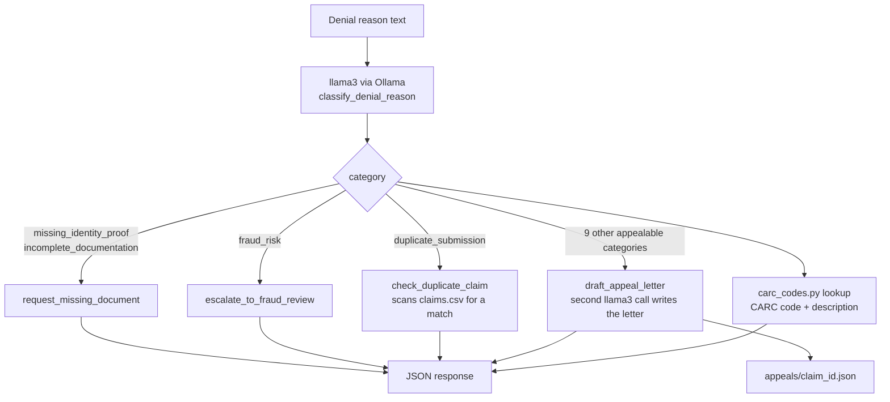

# AI Claim Denial Agent

## Problem

Insurance claim denials come with a free-text reason ("Out of network provider",
"Prior authorization missing", etc.) written by whoever processed the claim. Turning
that text into a concrete next action - request a document, flag for fraud review,
check for a duplicate, or draft an appeal - is normally a manual triage step. This
project automates that triage: it reads the denial reason, classifies it against
real insurance billing codes, and either takes an automated action or routes the
claim to the right human queue.

## How the agent actually decides what to do

The denial reason text is sent to a **local llama3 model running through Ollama**.
The model reads the text and classifies it into one of 13 CARC-coded categories -
this is a real inference call, not a hardcoded `if "fraud" in reason` check. That
classification then drives two things, both looked up from fixed tables in code
(not decided by the model, so the model can never call an action it wasn't given):

1. A **CARC (Claim Adjustment Reason Code)** label + description - see
   [`carc_codes.py`](carc_codes.py) for the 13 codes used and why each was chosen.
2. Which of four **tools** actually runs:

   | Tool | Used for |
   |---|---|
   | `request_missing_document` | Missing ID/KYC proof or incomplete medical documentation |
   | `escalate_to_fraud_review` | Fraud, forged/tampered documents, suspicious activity |
   | `check_duplicate_claim` | Claim looks like a repeat/duplicate submission |
   | `draft_appeal_letter` | Everything else appealable - coverage disputes, medical necessity, coding errors, prior auth, timely filing, network issues, benefit limits, data mismatches, coordination of benefits |

**Why a category → tool lookup table instead of asking the model to name a tool
directly:** base `llama3` (unlike `llama3.1+`) doesn't support Ollama's native
function/tool-calling API - see [Limitations](#limitations-and-honest-caveats).
So the model returns structured JSON (`{"reasoning": ..., "category": ...}`), and
Python dispatches from there. Routing tool selection through a fixed category
table (rather than having the model output a raw tool name) also means the model
can never call a tool that doesn't exist, while the actual classification
decision - the hard part - is still 100% the model's own reasoning over the text.

`draft_appeal_letter` makes a second LLM call to write an actual 2-3 paragraph
appeal letter referencing the claim ID, patient, amount, and CARC code, then
saves it to `appeals/<claim_id>.json`.



## Architecture

```
frontend/ (static HTML/CSS/JS)
     |  fetch('/analyze-claim/:id')
     v
app.py (FastAPI)  ------  main.py (CLI, same pipeline, no server)
     |
     +--> claim_store.py   (loads + validates claims.csv, shared by app.py and main.py)
     +--> claim_agent.py   (LLM classification, tool dispatch, appeal letter generation)
     |         |
     |         +--> carc_codes.py   (13-code CARC reference table)
     |         +--> ChatOllama (langchain-ollama) --> local Ollama server --> llama3
     +--> appeals/<claim_id>.json  (persisted appeal letters)
     +--> agent_logs.txt  (append-only action log)
```

One FastAPI service, no database, no auth, no microservices - small enough for one
person to run and explain end to end.

## Setup

**Prerequisite: Ollama must be running locally with the `llama3` model pulled.**

```bash
ollama pull llama3
ollama serve          # if it isn't already running as a background service
```

Then:

```bash
python -m venv venv
venv\Scripts\activate        # Windows
# source venv/bin/activate   # Mac/Linux

pip install -r requirements.txt

uvicorn app:app --reload
```

Open `frontend/index.html` in a browser (or serve it with any static file server),
enter a claim ID from `claims.csv` (e.g. `CLM104`), and click Analyze.

To run the same logic from the terminal instead of the API:

```bash
python main.py
```

### Running tests

```bash
pytest
```

Most tests call the real llama3 model (there's no mocked LLM - the whole point is
to prove the routing decision is genuinely model-driven) and will be skipped
automatically if Ollama isn't reachable. A few tests deliberately use paraphrased,
reworded denial reasons that share no keywords with the original wording, to
confirm the model is reasoning about meaning rather than matching strings.

## API

| Endpoint | Description |
|---|---|
| `GET /claims` | List all claims from `claims.csv` |
| `GET /capabilities` | The 13 CARC categories, their codes, and which tool each maps to |
| `GET /analyze-claim/{claim_id}` | Run the full pipeline for one claim |

Example `/analyze-claim/{id}` response fields: `decision_category`, `carc_code`,
`carc_description`, `tool_used`, `llm_reasoning`, `priority_level`,
`human_intervention_required`, `agent_action_result`, `escalation_queue`,
`appeal_letter` (present when `draft_appeal_letter` ran).

## Limitations and honest caveats

- **No native tool-calling.** `llama3` doesn't support Ollama's function-calling
  API (only newer models like `llama3.1+` do), so this uses the documented
  fallback of structured JSON output + Python-side dispatch instead of
  `.bind_tools()`. The reasoning is still the model's own.
- **No official CARC code for fraud.** Real payers route fraud suspicion to a
  Special Investigations Unit rather than printing a fraud-specific code on a
  member-facing EOB. `CO-A1` (a generic denial header code) is used as the
  closest honest fit - see the comment in `carc_codes.py`.
- **CPU inference is slow.** Each classification call takes several seconds on a
  CPU-only Ollama setup; the appeal-letter path makes a second LLM call on top of
  that.
- **13 CARC codes, not the full official list.** X12 publishes hundreds of CARC
  codes; this project maps a deliberately small subset to the categories it
  actually handles.
